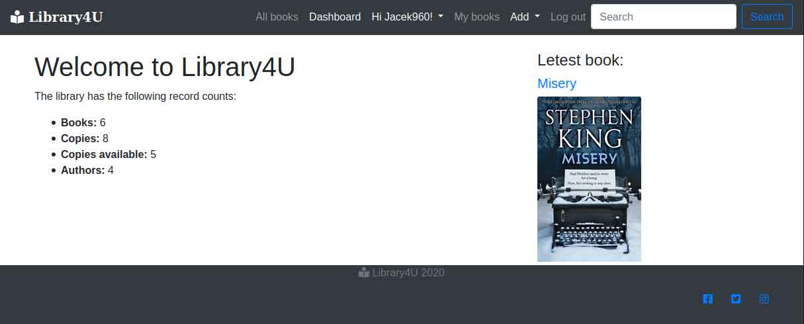
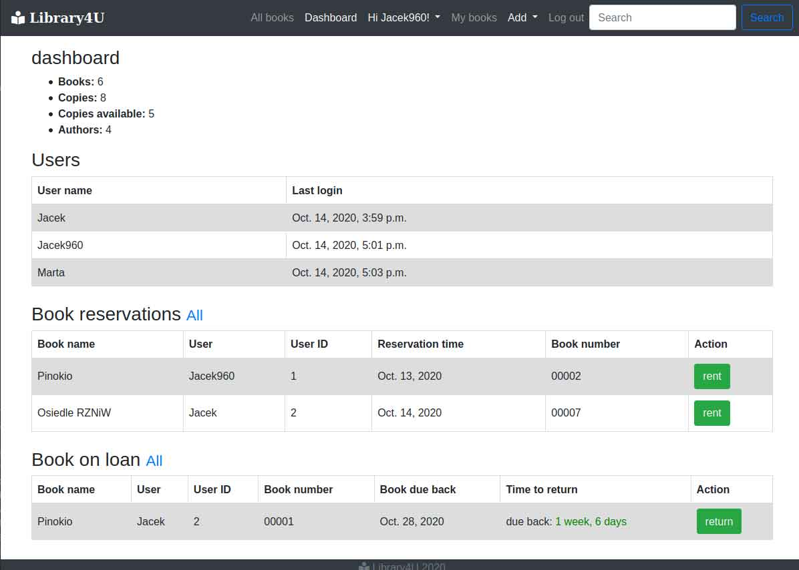
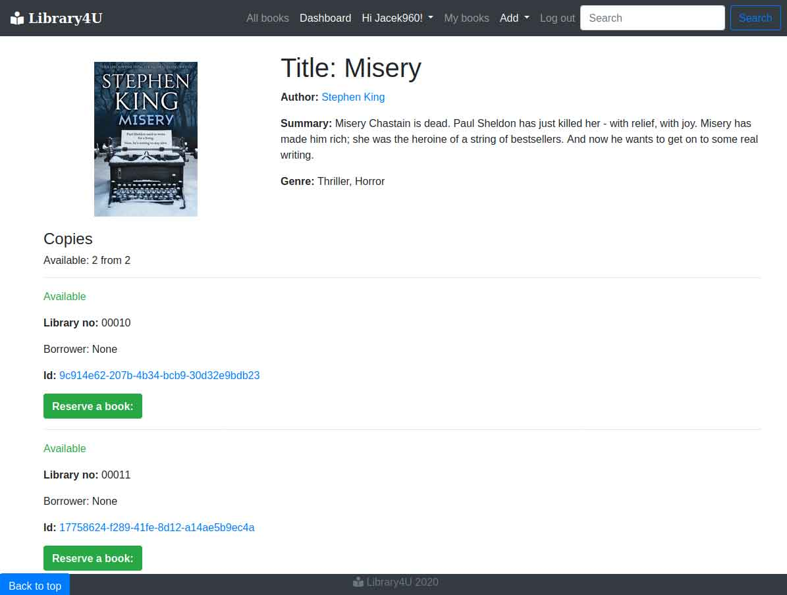
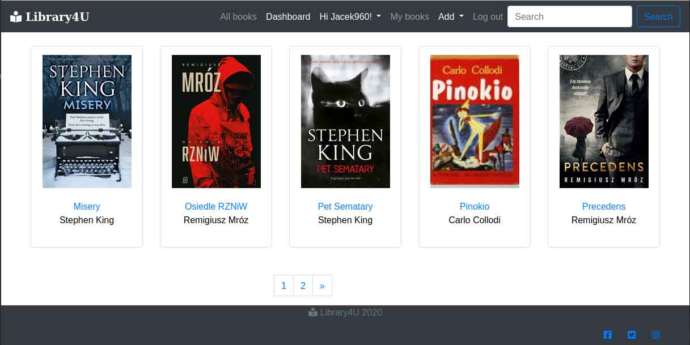
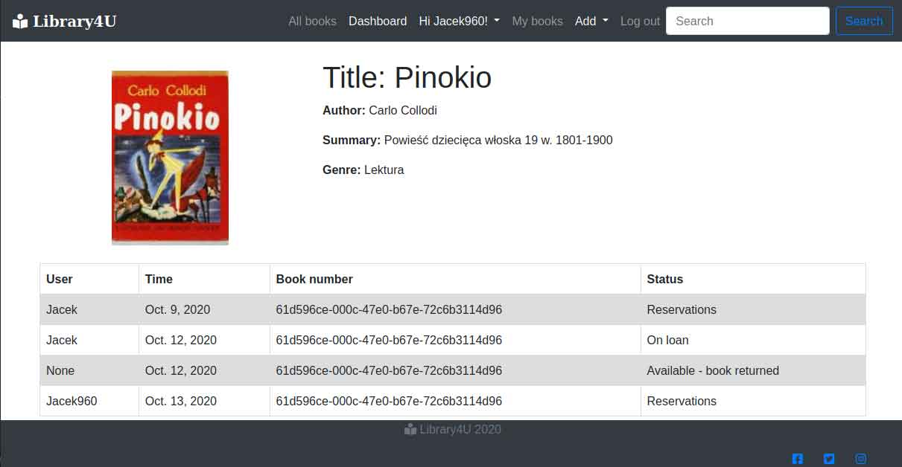

# Library management system 
> Website - local library system.

## Table of contents
* [General info](#general-info)
* [Screenshots](#screenshots)
* [Technologies](#technologies)
* [Setup](#setup)
* [Features](#features)
* [Status](#status)
* [Credits](#credits)
* [Contact](#contact)

## General info
Project - for local library. User can reserve a book from home. Librarian with dashboard system can manage reservations and book returns.

## Screenshots
Home Page

Dashbord

Book Page

All Book Page

Book History

## Technologies
* Django 3.1.2
* Python 3.8
* Bootstrap 4.0

## Setup
Use pip installation to install dependencies from requirements.txt
## Code requirements.txt

`$ pip install -r requirements.txt`

## Features
To-do list:
* Adjust templates

## Status
Project is: _in_progress_ small changes to by done. 

## Credits
Photos for project taken from official book authors website. Thank you all!

## Contact
Created by [Jacek960](mailto:j.kuciel@outlook.com)- feel free to contact me!

